# Étape 0 - configurer IntelliJ et Java

Dans cette étape, nous allons nous assurer que Java 25
est bien installé et configuré dans le projet.

## Configurer Java 25 sur votre projet

> Vous devriez voir ceci
> 
> 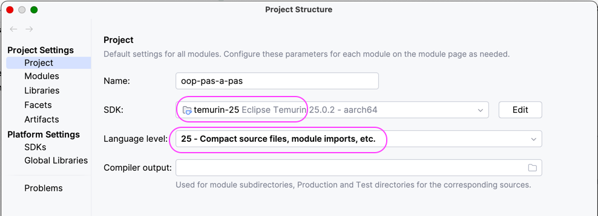
> 
> Si c'est le cas, **il n'y a rien à faire**.
> 
> Votre SDK Java 25 **est correctement configuré**.

---

Si aucun SDK Java n'a été détecté, SDK : `<No SDK>`

- SDK : Ouvrir le menu déroulant

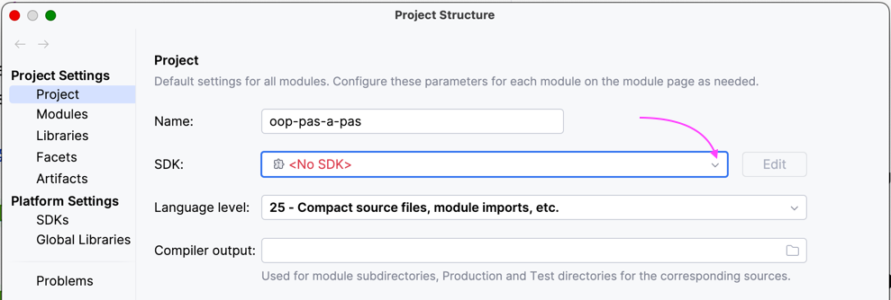

---

- Cliquer du **"Download JDK"** (Télécharger JDK)

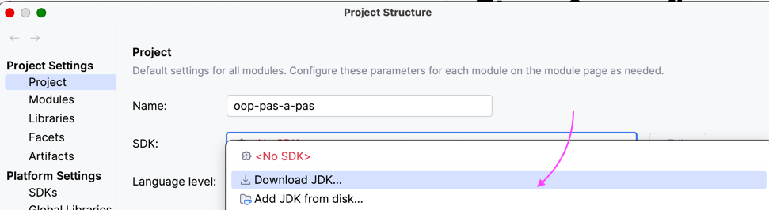

- Ouvrir la liste déroulante "Vendor"
- Sélectionner **"Eclipse Temurin (AdoptOpenJDK HotSpot)"**

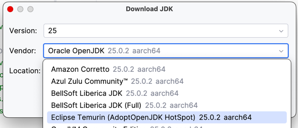

---

La fenêtre devrait ressembler à ceci : 

- Cliquer sur **"Download"** (Télécharger)

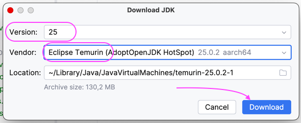

---

Après quelques instants, vous devriez avoir ceci :

---

Confirmer la configuration du projet en cliquant sur **OK**.

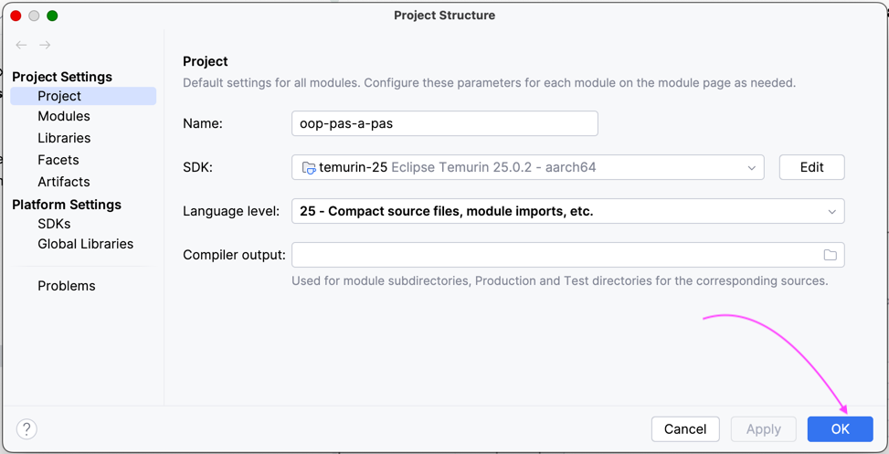

---

Votre projet est désormais **configuré pour Java 25**.

## (Optionnel) Plugins pouvant être désactivés

Certains **plugins** de Intellij peuvent être gourmands en ressources.

Il est possible d'en désactiver certains sans impact majeur sur l'expérience de développement.

Pour activer/désactiver des plugins.

---

**1 - Ouvrir les "Settings"** 

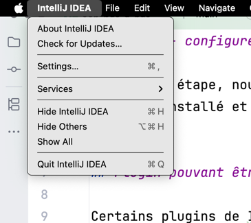

---

**2 - Se positionner sur "Plugins"**

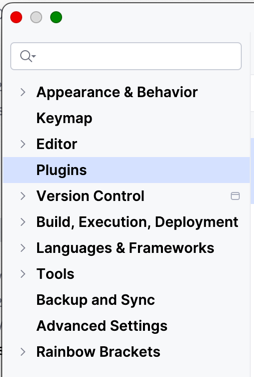

---

**3 - Filtrer les plugins "bundled"**

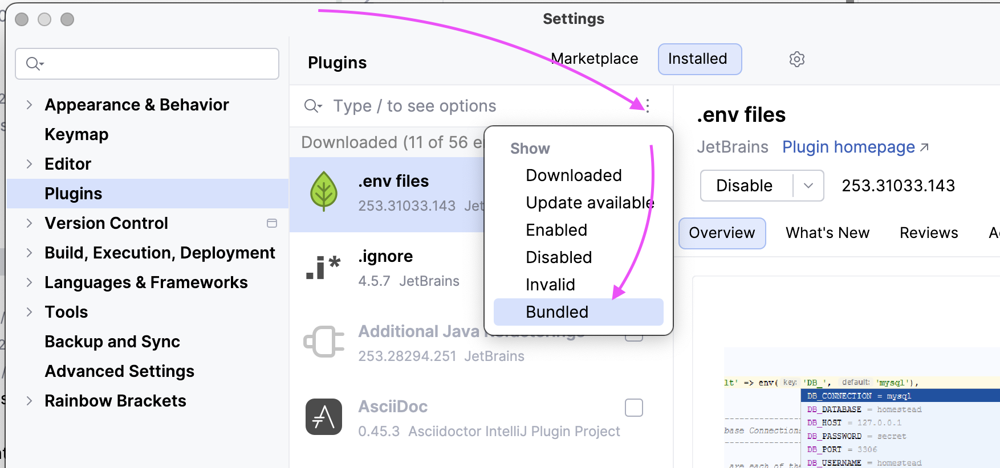

---

**4 - Désactiver le plugin "MCP Server"**

- Trouver un plugin nommé "MCP Server"
- Le désactiver en décochant la case

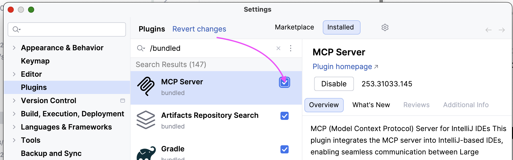

Quand il est désactivé, il doit **être grisé**.

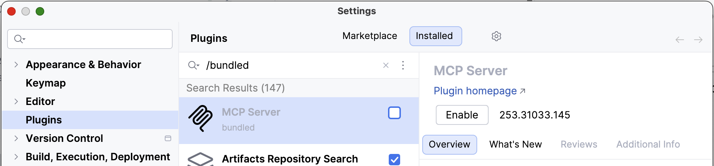

---

**4 - Désactiver les plugins se basant sur de l'IA locale**

Les plugins basés sur de l'IA peuvent être désactivés
car ils peuvent consommer beaucoup de ressources :

- Full Line Code Completion
- Machine Learning Code Completion
- Machine Learning Find Usages
- Machine Learning in Search Everywhere

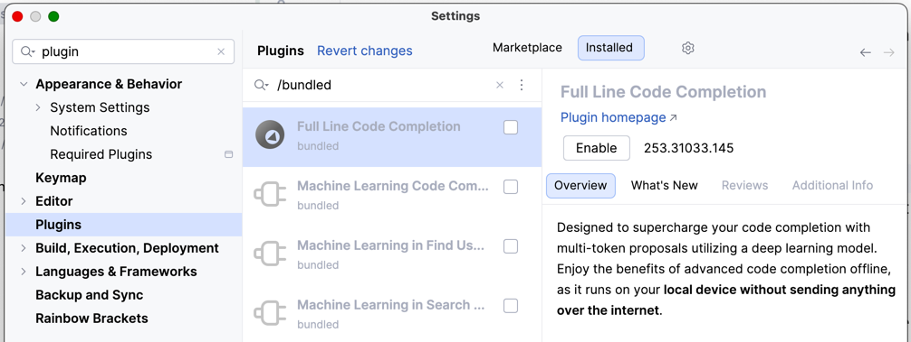

---

**5 - Valider la configuration en appuyant sur OK**

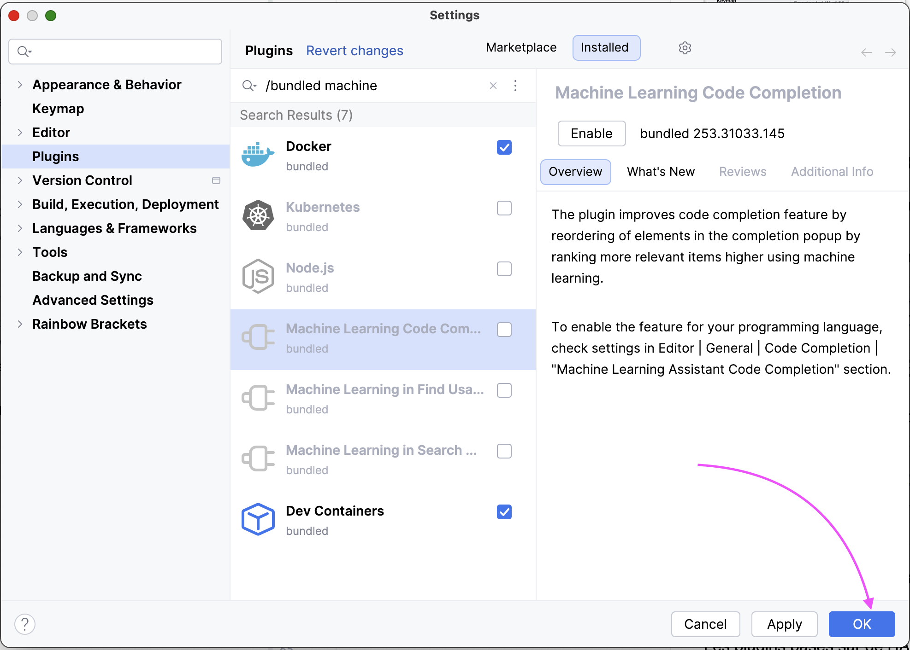

---

**6 - Confirmer s'il est demandé de redémarrer**

En cliquant sur "Restart" (ou "Redémarrer")

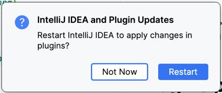
