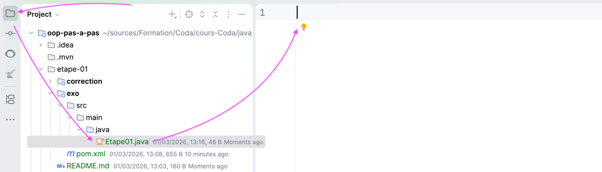

# Etape 01 - Hello World !

Dans cet exercice, nous allons écrire un premier programme Java.

Ensuite, nous l'exécuterons avec IntelliJ Idea.

## Écrire notre programme

Un code Java se trouve dans un fichier dont le nom se termine par `.java`.

Un fichier vide est déjà présent dans l'exercice.

Mais il faut écrire du code pour pouvoir en faire un vrai programme Java.

---

**1 - Ouvrir le fichier `Etape01.java`** 

Il est situé à l'emplacement suivant : [exo/src/main/java/Etape01.java](exo/src/main/java/Etape01.java)



---

> ‼️ Si un bandeau indique que le SDK n'est pas configuré, 
> [se rendre à l'étape 00](../etape-00/README.md) pour régler le problème
> 
> 

---

**2 - Ecrire le code suivant :**

```java
void main() {
    
}
```

---

**3 - Entre les accolades du bloc `void main() {    }`** 

- ajouter le code suivant : 

```java
IO.println("Hello World!");
```

Le résultat devrait ressembler à ceci : 


---

## Comprendre le programme


