# Etape 01 - Hello World !

Dans cet exercice, nous allons écrire un premier programme Java.

Ensuite, nous l'exécuterons avec IntelliJ Idea.

## Écrire notre programme

Un code Java se trouve dans un fichier dont le nom se termine par `.java`.

Un fichier vide est déjà présent dans l'exercice.

Mais il faut écrire du code pour pouvoir en faire un vrai programme Java.

---

### 1 - Ouvrir le fichier `Etape01.java` 

Il est situé à l'emplacement suivant : [exo/src/main/java/Etape01.java](exo/src/main/java/Etape01.java)


---

> ‼️ Si un bandeau indique que le SDK n'est pas configuré, 
> [se rendre à l'étape 00](../etape-00/README.md) pour régler le problème
> 
> 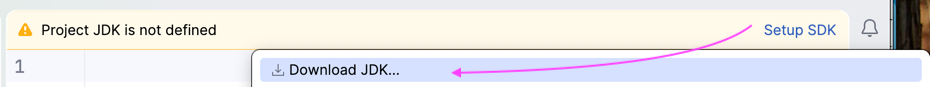

---

### 2 - Écrire le code suivant

```java
void main() {
    
}
```


### 3 - Écrire le corps de la méthode `main()` 

Dans le corps de la méthode `main`.

C'est à dire, entre les accolades du bloc `void main() {    }`

- ajouter le code suivant : 

```java
IO.println("Hello World!");
```

Le résultat devrait ressembler à ceci : 

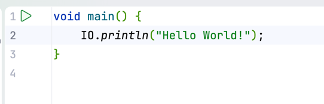

---

## Exécution du programme

Pour exécuter le programme on peut cliquer sur le symbole 

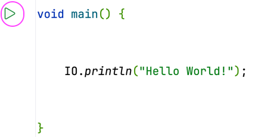

---

Confirmer pour exécuter

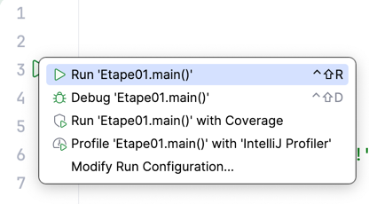

---

Si le programme est **correct** (il compile),
il est exécuté dans **une console** ouverte automatiquement
par IntelliJ.

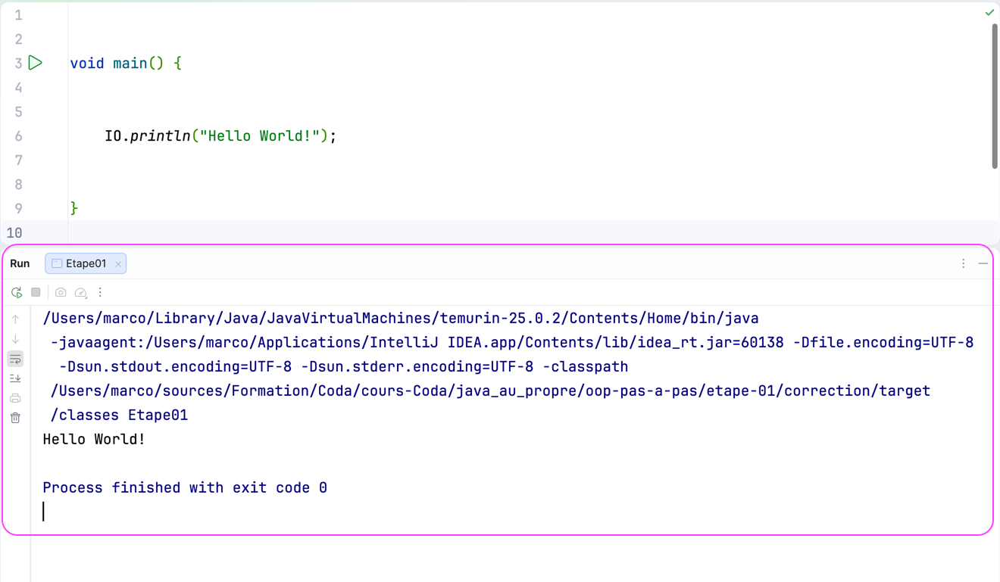

---

Dans cette **console**, on trouve du texte

1. La **commande** `java` pour lancer le programme
2. Le texte **affiché par le programme**
3. **exit code** : Le code de sortie du programme

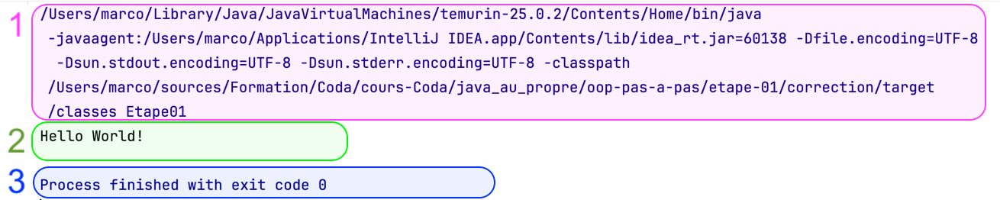

### 1 - La commande `java`

IntelliJ génère et lance pour nous **la commande `java`** ainsi que ses **arguments**.

Cela nous évite de le faire à la main.

La commande `java` est un outil en ligne de commandes.

Il permet d'exécuter un programme Java depuis un terminal.

Voici un exemple de commande générée par IntelliJ quand on lance un programme :

```shell
/Users/marco/Library/Java/JavaVirtualMachines/temurin-25.0.2/Contents/Home/bin/java \
-javaagent:/Users/marco/Applications/IntelliJ IDEA.app/Contents/lib/idea_rt.jar=60138 \
-Dfile.encoding=UTF-8 \
-Dsun.stdout.encoding=UTF-8 \
-Dsun.stderr.encoding=UTF-8 \
-classpath oop-pas-a-pas/etape-01/exo/target/classes \
Etape01
```

---

En la simplifiant, on pourrait exécuter la commande dans un terminal depuis le chemin `etape-01/exo/`

```shell
java -classpath exo/target/classes Etape01
```

Le résultat attendu : 

```text
Hello World!
```

### 2 - Le texte affiché par le programme

C'est ce qui est affiché lors de l'exécution du programme.

Quand notre programme exécute l'instruction :

```java
IO.println("Hello World!");
```

Alors, une nouvelle ligne de texte est affichée : 

```text
Hello World!
```

### 3 - exit code - Le code de sortie du programme

Intellij nous indique si le programme s'est terminé correctement ou pas.

**code : 0** si le programme s'est terminé **correctement**.
```text
Process finished with exit code 0
```

---

**Un autre code** si le programmé **échoue**.

Ex. Si on faisait une opération arithmétique interdite comme une division par zéro,

Le programme **échouerait** en renvoyant **un code de sortie différent de 0**.

```java
void main() {
    int divisionParZero = 1/0;
}
```

```text
Exception in thread "main" java.lang.ArithmeticException: / by zero
	at Etape01.main(Etape01.java:6)

Process finished with exit code 1
```

## Comprendre le programme

Un programme Java est lancé depuis un fichier dont le nom se termine par `.java`.

Ce fichier doit contenir une méthode `void main(){}`.

Les **instructions** de ce programme sont exécutées l'une après l'autre.

Lorsque le programme se termine correctement le **code de sortie** est 0.


### La méthode `void main() {}`
La méthode `void main()` est le point de départ d'un programme Java.

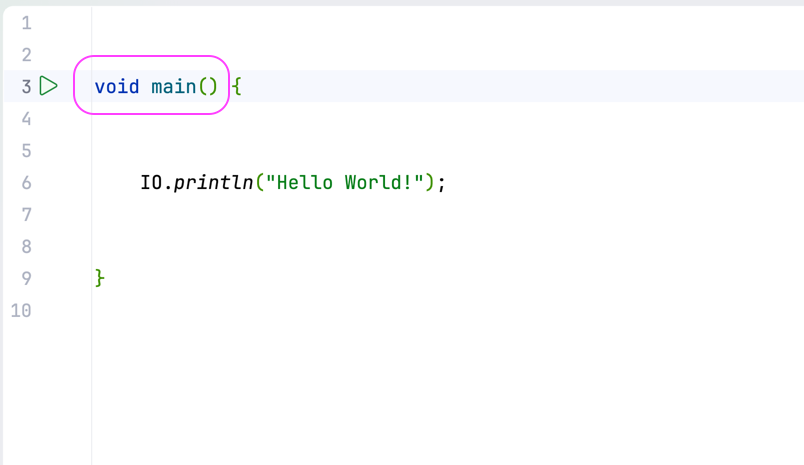

---

Elle comprend **un bloc** délimité par des accolades `{       }`.

**Les instructions** du programme doivent se trouver **à l'intérieur des accolades** délimitant ce **bloc**.

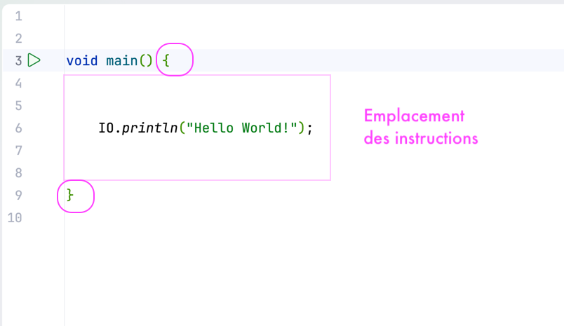

---

> ‼️ Un programme Java **ne peut pas être exécuté** s'il ne contient pas 
> **au moins un** fichier `.java`
> dans lequel on trouve **une méthode `void main() { }`**.

### Les instructions

Explication de **l'instruction** `IO.println("Hello World!");`

En Java, une instruction se termine par un `;`.

- `IO` est un groupement de **méthodes** permettant
  - d'afficher du texte dans la console
  - le récupérer du texte saisi depuis la console


La méthode `IO.println(    )` permet d'**afficher du texte** dans **la console**.

Ce texte est **donné en argument** de la méthode.

```java
IO.println("Hello World!");
```

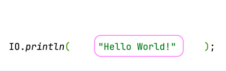


## Complétion automatique

Pour connaitre les méthodes disponibles dans `IO`, 
il faut utiliser `IO.` suivi du nom de la méthode.

> **Astuce :** lorsqu'on saisit `IO.` dans le bloc d'instructions,
> Intellij nous aide en nous proposant les choix possibles :
>
> 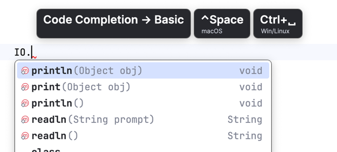
>
> C'est ce qu'on appelle **la complétion de code**.
>
> La complétion indique les **choix possibles** et les **variations de ces choix**.
>
> On verra que dans Java avec IntelliJ, la complétion de code est très pratique et très utilisée.
>
> Pour **gagner du temps** on peut utiliser **les raccourcis clavier**


## Javadoc - Documentation rapide

Les différentes **bibliothèques** qui constituent le JDK sont documentées par la **Javadoc**.

Cette documentation nous permet de savoir à quoi servent chacun des composants (méthodes, classes, packages, ...).

---

Comment savoir à quoi servent les différentes **méthodes** disponibles dans `IO` ?

> **Astuce :** en survolant du code avec la souris (sans cliquer),
> 
> IntelliJ nous affiche la documentation de ce code.
> 
> Dans l'exemple ci-dessous, j'ai positionné ma souris au dessus du mot `println`
> 
> 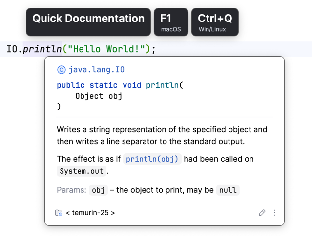
> 
> ---
> 
> On peut aussi utiliser la documentation rapide sur `IO`.
> 
> 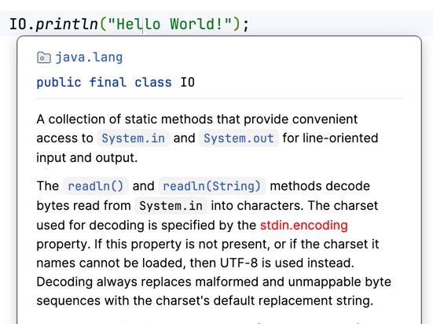
> ---
> 
> Pour gagner du temps, utilisez les **raccourcis clavier**
