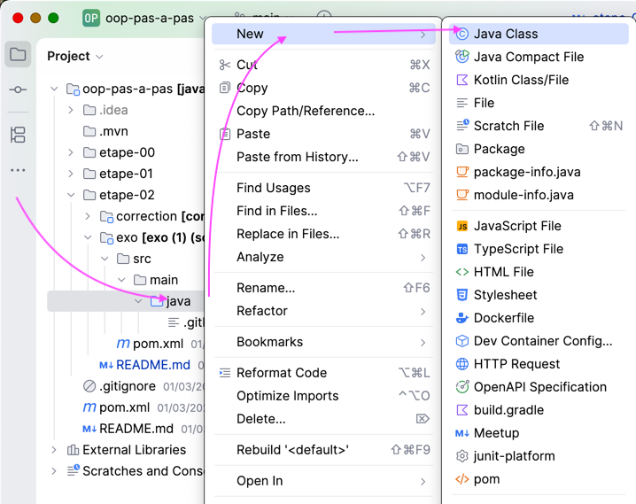
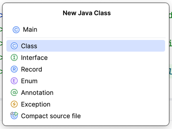
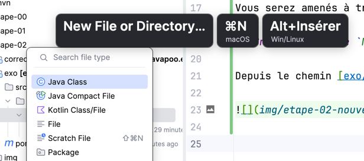
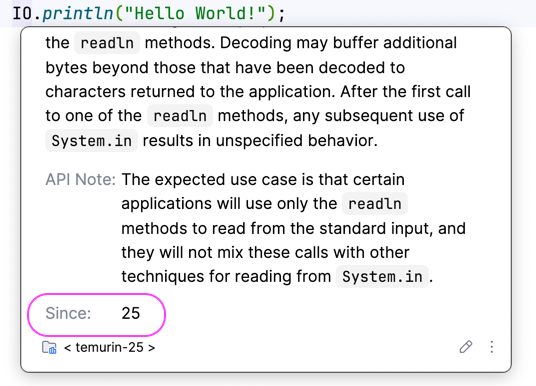

# Étape 02 - Hello World ! à l'ancienne

Dans cette étape, nous présentons une autre façon de décrire un programme en Java.

- Syntaxe d'un programme principal : méthode `public static void main(String[] args){}` dans une **classe**
- Afficher du texte avec `System.out.println()`
- Lire et comprendre la Javadoc de `System`, `System.out` et `System.out.println`

## Syntaxe "à l'ancienne"

Avant Java 21-25, nous devions écrire un peu plus de code pour le point de départ d'un programme.

Comme très peu de programmes sont écrits en Java 25,
il est important de connaitre cette autre façon d'écrire
le point d'entrée d'un programme Java.


Vous serez amenés à travailler sur des projets qui ne sont pas encore sur Java 25.

## Créer une classe `Main`

Depuis le chemin [exo/src/main/java](exo/src/main/java), créez **une nouvelle classe** que vous nommerez `Main`.



---

- Saisir `Main`
- Valider avec la touche "Entrée"



---

> Astuce : si vous cliquez sur le dossier `src/main/java`
> 
> Vous pouvez utiliser un raccourci clavier pour créer un nouveau fichier
> 
> 

---

Vous obtenez un fichier [exo/src/main/java/Main.java](exo/src/main/java/Main.java)
dont le contenu est le suivant :

```java
public class Main {
}
```

---

Pour le moment, ce n'est pas un programme car il ne contient pas de méthode `main`.

## Créer une méthode `main`

Dans le fichier [exo/src/main/java/Main.java](exo/src/main/java/Main.java),

Saisissez le code suivant **à la suite de** `public class Main`
et **à l'intérieur des accolades** `{     } `

```java
public static void main(String[] args) {
        
}
```

Le résultat devrait être le suivant : 

`Main.java`
```java
public class Main {
    public static void main(String[] args) {
        
    }
}
```

---

Ce code compliqué est l'équivalent du code suivant qu'on a écrit lors de l'étape 01 : 

---

```java
main(){
    
}
```

---

## Pourquoi connaitre la syntaxe "à l'ancienne" ?

> ‼️Si on utilise une version de Java plus ancienne que 25,
> par exemple Java 17, 
> on **ne peut pas** utiliser la **syntaxe moderne** :
> 
> ```java
> main() {
> 
> }
> ```
> 
> On doit utiliser la **syntaxe classique** : 
> 
> ```java
> public class Main {
>     public static void main(String[] args) {
>         
>     }
> }
> ``` 

## La bibliothèque `IO` est apparue en Java 25

Avec des versions de Java plus anciennes que 25, 
les utilitaires `IO` ne sont pas disponibles.

`IO` a été introduit en Java 25.

En consultant **la Javadoc** de `IO`, on peut voir
que cette **bibliothèque** est apparue en version 25 de Java.



## Afficher du texte avec `System.out.println()`

Avant Java 25, on doit utiliser `System.out.println()` pour afficher du texte.

---

Dans le fichier [exo/src/main/java/Main.java](exo/src/main/java/Main.java),
à l'intérieur des accolades de la méthode `public static void main(String[] args)`.

**1 - Saisir le code suivant** : 

```java
System.out.println("Hello World!");
```

Le code complet devrait être le suivant : 

`Main.java`
```java
public class Main {
    public static void main(String[] args) {
        System.out.println("Hello World!"); 
    }
}
```

---

**2 - exécuter le programme**

> Voir [l'étape 01](../etape-01/README.md) si vous avez oublié comment faire.

Le texte du programme affiché devrait être : 

```text
Hello World!
```

---

## Exercice Javadoc

**1 - consultez la Javadoc**

> Voir [l'étape 01](../etape-01/README.md) si vous avez oublié comment faire.


**2 - En lisant la Javadoc de `System`**

- À quelle version de Java est apparu `System` ?

---

**3 - En lisant la javadoc de `System.out`**

> The <mark>`__________`</mark> output stream.
> This stream is already open and ready 
> to accept output data. Typically this 
> stream corresponds to display output 
> or another output destination specified 
> by the host environment or user.

Quel mot devrait-on trouver 
à la place de <mark>`__________`</mark> ?

---

**3 - En lisant la javadoc de `System.out.println`**

> Prints a String and then terminates the line. 
> This method behaves as though 
> it invokes <mark>`____A____`</mark> and then <mark>`____B____`</mark>.

Que devrait-on trouver en place de 

- <mark>`____A____`</mark> : 
- <mark>`____B____`</mark> :

