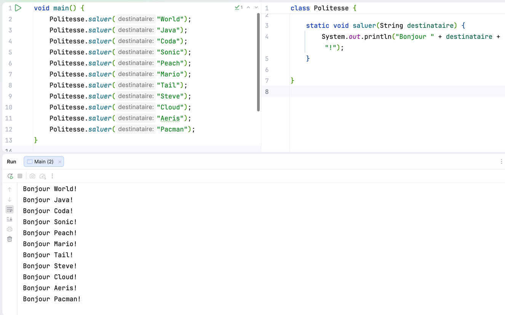

# Étape 03 - méthode et code dans plusieurs fichiers

Lors de cette étape, nous allons :
- Écrire du code dans plusieurs méthodes
- Écrire du code dans plusieurs fichiers


## Préparation

Créer un fichier Java nommé `Main.java` à l'emplacement suivant : [src/main/java](exo/src/main/java).

> Vous pouvez utiliser la syntaxe moderne (vue en [étape 01](../etape-01/README.md)), 
ou la syntaxe classique (vue en [étape 02](../etape-02/README.md)).

Faites en sorte que ce fichier contienne ce qu'il faut pour être **un programme Java exécutable**.


## Écrire du code dans plusieurs méthodes

Il est important de réduire **la duplication** dans le code.

Voici un exemple de code dupliqué : 

```java
void main() {
    System.out.println("Hello World!");
    System.out.println("Hello Java!");
    System.out.println("Hello Coda!");
}
```

- D'après-vous qu'est-ce qui pourrait poser un problème avec ce code ?

La suite de l'exercice va nous permettre de mieux comprendre 
le problème de la duplication **par le vécu**. 

---

**1 - Ajouter le code suivant** 

Dans votre fichier [exo/src/main/java/Main.java](exo/src/main/java/Main.java).

À l'intérieur **du bloc** de la méthode `main`.

Ajouter **les instructions suivantes** : 

```java
System.out.println("Hello World!");
System.out.println("Hello Java!");
System.out.println("Hello Coda!");
System.out.println("Hello Sonic!");
System.out.println("Hello Peach!");
System.out.println("Hello Mario!");
System.out.println("Hello Tail!");
System.out.println("Hello Steve!");
System.out.println("Hello Cloud!");
System.out.println("Hello Aeris!");
System.out.println("Hello Pacman!");
```

---

**2 - Exécutez le programme**

Il devrait afficher : 

```text
Hello World!
Hello Java!
Hello Coda!
Hello Sonic!
Hello Peach!
Hello Mario!
Hello Tail!
Hello Steve!
Hello Cloud!
Hello Aeris!
Hello Pacman!
```

---

Nous voulons changer le résultat du programme pour afficher `Bonjour` au lieu de `Hello`.

Au lieu d'afficher : 
```text
Hello World!
Hello Java!
Hello Coda!
...
```

Le programme devrait afficher :

```text
Bonjour World!
Bonjour Java!
Bonjour Coda!
...
```

---

3 - Modifier le programme pour afficher `Bonjour` à la place de `Hello`.

- Combien de lignes de code a-t-on dû changer ?

Nombre de lignes changées : <mark>`___`</mark>

---


**4 - Trouver la duplication**

> Pour savoir **ce qui est dupliqué**, 
> on peut se poser la question : 
> **"Qu'est-ce qui est similaire ?"**

Voici ce qui est dupliqué
- `Bonjour `
- `!`

```text
Bonjour Java!
Bonjour Coda!
^^^^^^^^    ^
||||||||    |
```


> On peut aussi poser le problème dans l'autre sens 
> en se posant la question : 
> **"Qu'est-ce qui est différent ?"**.


Voici ce qui est différent
- `Java`
- `Coda`

```text
Bonjour Java!
Bonjour Coda!
        ^^^^
        ||||
```

---

**5 - Écrire une méthode pour réutiliser du code**

Nous avons trouvé ce qui est **similaire** et ce qui est **différent**.

Dans votre fichier [exo/src/main/java/Main.java](exo/src/main/java/Main.java).

**À la suite** de la méthode `main(){ }`.

Autrement dit, **une ou plusieurs lignes en dessous** de son **accolade fermante** `}`.

Écrivons une méthode `void saluer(String destinataire){ }`

Cette méthode nous permettra d'éviter de répéter ce qui est commun dans la salutation :

Pour le moment cette méthode ne fait rien.

```java
void saluer(String destinataire){
    
}
```

Votre fichier `Main.java` devrait ressembler à ceci :


```java
void main() {
    System.out.println("Hello World!");
    System.out.println("Hello Java!");
    System.out.println("Hello Coda!");
    System.out.println("Hello Sonic!");
    System.out.println("Hello Peach!");
    System.out.println("Hello Mario!");
    System.out.println("Hello Tail!");
    System.out.println("Hello Steve!");
    System.out.println("Hello Cloud!");
    System.out.println("Hello Aeris!");
    System.out.println("Hello Pacman!");
}

void saluer(String destinataire){

}
```

---

**6 - écrire le corps de la méthode `void saluer(String destinataire)`**

Le corps de la méthode `void saluer(String destinataire)`, c'est
les instructions contenues à l'intérieur de **son bloc**.

C'est-à-dire, à l'intérieur des accolades de celle-ci.

```java
System.out.println("Hello " + destinataire + "!");
```

Le code de la méthode devrait ressembler à ceci :

```java
void saluer(String destinataire) {
    System.out.println("Hello " + destinataire + "!");
}
```

---

**7 - Utiliser la méthode à la place du code précédent**

Nous avons **factorisé** le code dans une méthode qui peut saluer n'importe quel destinataire.

Modifions **les instructions** présentes 
dans **le corps** de la méthode `void main()` 
pour utiliser notre méthode `void saluer(String destinataire)`.

C'est-à-dire, remplacer le code suivant... 
```java
    System.out.println("Hello World!");
    System.out.println("Hello Java!");
    System.out.println("Hello Coda!");
    System.out.println("Hello Sonic!");
    System.out.println("Hello Peach!");
    System.out.println("Hello Mario!");
    System.out.println("Hello Tail!");
    System.out.println("Hello Steve!");
    System.out.println("Hello Cloud!");
    System.out.println("Hello Aeris!");
    System.out.println("Hello Pacman!");
```

... par le code : 

```java
    saluer("World");
    saluer("Java");
    saluer("Coda");
    saluer("Sonic");
    saluer("Peach");
    saluer("Mario");
    saluer("Tail");
    saluer("Steve");
    saluer("Cloud");
    saluer("Aeris");
    saluer("Pacman");
```

---

**8 - exécuter le programme**

Exécuter le programme [exo/src/main/java/Main.java](exo/src/main/java/Main.java).

Le résultat affiché devrait être 

```text
Hello World!
Hello Java!
Hello Coda!
Hello Sonic!
Hello Peach!
Hello Mario!
Hello Tail!
Hello Steve!
Hello Cloud!
Hello Aeris!
Hello Pacman!
```

**9 - modifier la méthode `void saluer(String destinataire)`**

Nous avons vérifié que le programme continue d'afficher correctement les salutations.

Modifions maintenant la méthode `saluer` 
pour remplacer `Hello` par `Bonjour`.

```java
void saluer(String destinataire) {
    System.out.println("Bonjour " + destinataire + "!");
}
```

**10 - exécuter le programme**

Il devrait afficher :

```text
Bonjour World!
Bonjour Java!
Bonjour Coda!
Bonjour Sonic!
Bonjour Peach!
Bonjour Mario!
Bonjour Tail!
Bonjour Steve!
Bonjour Cloud!
Bonjour Aeris!
Bonjour Pacman!
```

**11 - rétrospection**

**Après avoir créé** la méthode `saluer` et l'avoir **utilisée** depuis le programme principal.

- Combien de lignes de code ont été nécessaires
  pour remplacer `Hello` par `Bonjour` ?

Nombre de lignes changées : <mark>`___`</mark>

## Écrire du code dans plusieurs fichiers

Quand un programme grossit, il est nécessaire de le découper dans plusieurs fichiers.

Un programme qui tient sur un seul fichier est très compliqué à maintenir.

Imaginons que nous souhaitions utiliser la méthode `void saluer(String destinataire)` à un autre endroit du programme.


---

**1 - Préparer le terrain**

Nous devons créer le fichier dans lequel nous pourrons déplacer la méthode `saluer`.

Depuis le dossier `exo/src/main/java`.

Créer une classe nommée `Politesse`.

Votre arborescence de fichier devrait ressembler à ceci: 

```text
└── exo
    └── src
        └── main
            └── java
                ├── Main.java
                └── Politesse.java
```

Le contenu du fichier `Politesse.java` devrait être le suivant : 

```java
public class Politesse {

}
```

---

**2 - déplacer la méthode `saluer` de `Main.java` vers `Politesse.java`**

`Main.java`
```java
void main() {
    saluer("World");
    saluer("Java");
    saluer("Coda");
    saluer("Sonic");
    saluer("Peach");
    saluer("Mario");
    saluer("Tail");
    saluer("Steve");
    saluer("Cloud");
    saluer("Aeris");
    saluer("Pacman");
}
```

`Politesse.java`
```java
class Politesse {

    void saluer(String destinataire) {
        System.out.println("Bonjour " + destinataire + "!");
    }
}
```

---

**3 - vérifier que le code est correcte en l'exécutant**

Essayer de lancer le programme pour voir si ça fonctionne.

```text
java: cannot find symbol
  symbol:   method saluer(java.lang.String)
  location: class Main
```

---

**4 - Modifier **la signature** de la méthode `saluer`**

Dans le fichier `Politesse.java`.

En l'occurrence, ajouter `static` avant `void saluer(String destinataire)`

```java
static void saluer(String destinataire) {
```

---

**5 - Dans `Main.java`, modifier les appels de la méthode `saluer`**

- Retourner dans le fichier `Main.java`
- Ajouter `Politesse.` avant chaque appel de la méthode `saluer`.

Ex : `Politesse.saluer("World");` à la place de `saluer("World");`

Dans `Main.java`, le code de la méthode `main()` 
devrait ressembler à ceci : 

```java
void main() {
    Politesse.saluer("World");
    Politesse.saluer("Java");
    Politesse.saluer("Coda");
    Politesse.saluer("Sonic");
    Politesse.saluer("Peach");
    Politesse.saluer("Mario");
    Politesse.saluer("Tail");
    Politesse.saluer("Steve");
    Politesse.saluer("Cloud");
    Politesse.saluer("Aeris");
    Politesse.saluer("Pacman");
}
```

---

**6 - lancer le programme pour vérifier son fonctionnement**

Le programme devrait fonctionner de nouveau.

> **💡 Astuce :** vous pouvez afficher plusieurs fichiers
> en même temps dans IntelliJ
> 
> Par exemple : 
> - à gauche, le programme principal `Main.java`
> - à droite, le fichier `Politesse.java`
> 
> 

### Pourquoi `static` ?

Le mot-clé `static` permet de dire que la méthode est statique.

C'est à dire qu'elle est utilisable de façon globale sans avoir besoin d'instancier la classe Politesse.

Nous verrons plus en détails ce que ça implique quand nous verrons le concept de classes en Java.

Pour l'instant, nous pouvons nous contenter de savoir
- comment on appelle une méthode statique
- comment on déclare une méthode statique

### Appeler une méthode statique

`NomDeClasse.nomDeMethode(arguments)`

Ex. 
```java
main(){
    Politesse.saluer("Aeris");
    
    // 💡 IO.println est aussi une méthode statique
    IO.println("Message");
}
```

### Déclarer une méthode statique 

Dans une classe, ajouter `static` au début de la **signature** d'une méthode.

```java
class Politesse{
    
    static void saluer(String destinataire){
        // ...
    }
    
}
```
